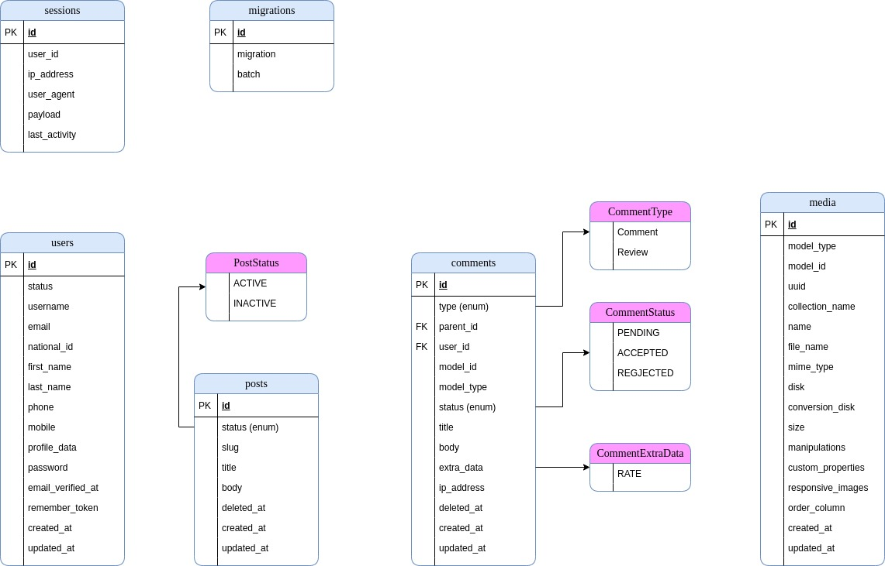
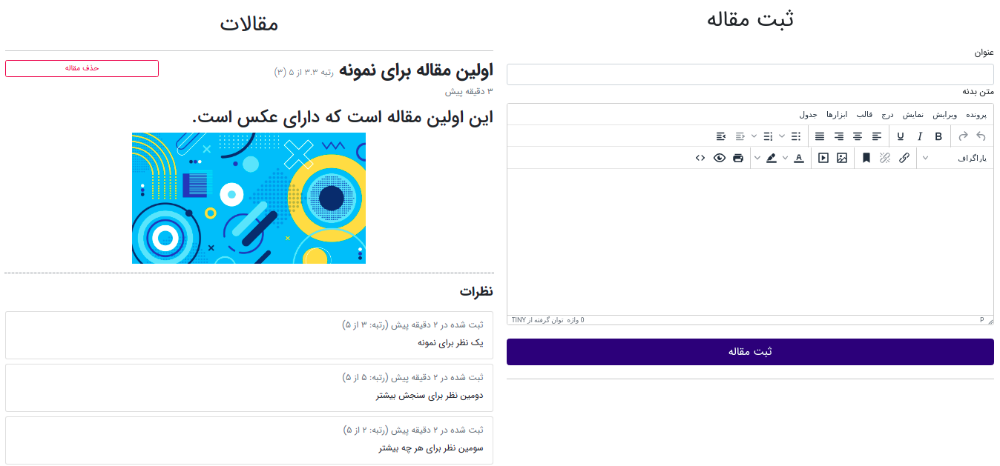
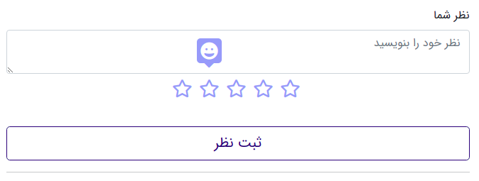
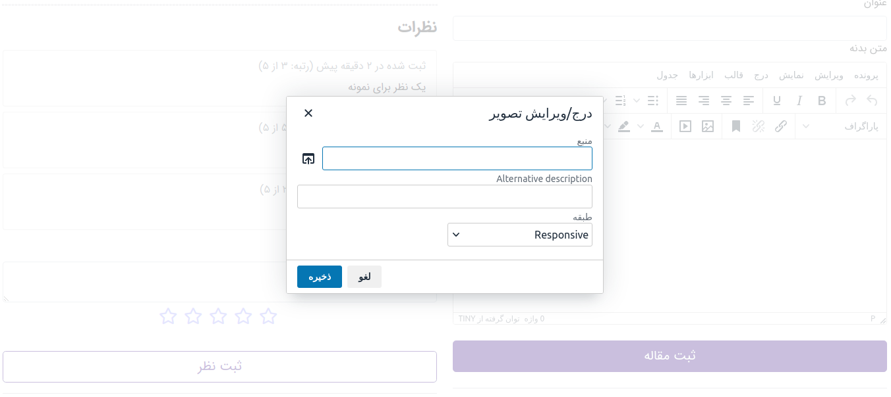

# NAK interview app

This project was written exclusively for the interview question of NAK corporation.

Despite the simplicity of this project, it was tried to present an advanced enterprise workflow in it.
This project has 3 main Namespaces, including *App*, *Domain* and *Support*. The responsibility of 
these namespaces and the idea of this design are derived from [this blog series](https://stitcher.io/blog/laravel-beyond-crud-01-domain-oriented-laravel).

Development of this app was based on **TDD** approach and there is a test for every core functionality.

Facade pattern and separation of concerns (SOC) was also considered in this project and can be found on both post
and comments.

**Last word:** It is obvious that such a complex workflow is not necessary for a simple project like current app,
and all of these attempts are just for presentation. 

#### List of contents
- [Installation](#installation)
    - [Installing using git](#installing-using-git)
    - [Fast Installation](#fast-installation)
- [Main Features](#main-features)
- [Design Elements](#design-elements)
- [Demo](#demo)

## <a name="installation">Installation</a>
### <a name="installing-using-git">Installing using git</a>
1. Clone the project
```bash
git clone https://bitbucket.org/ashrafibabak/nak-interview-app.git
```
2. Enter root folder of the project and copy `.env.example` file as `.env` and define database name and database credentials(username, password)
inside `.env` file.
   
3. Install the project using composer
```bash
composer install
```

4. Run below command to create the application key
```bash
php artisan key:generate --ansi
```

5. Now, you need to create your database tables by running below command in terminal or cmd.
```bash
php artisan migrate
```

6. Run the server

- You can run laravel's built-in server by running below command.
```bash
php artisan serve
```
- Or setup an external server and config it to read from the 
  public folder of the project.
  
**Notice:**
Project tests can be run by running `composer test` or`php artisan test`

### <a name="fast-installation">Fast Installation</a>
In this method, you don't need to create database and run migration, they
will be run automatically.

**Notice:** You need to have enabled `sqlite3` php module in your php.ini for running this setup.

1. Run below command to create the project by composer
```bash
composer create-project nak/interview:dev-master interview --repository-url="{\"url\": \"https://bitbucket.org/ashrafibabak/nak-interview-app.git\", \"type\": \"vcs\"}" --stability=dev --keep-vcs --no-secure-http
```

2. Run below command to enter the project folder and run the laravel server
```bash
cd interview && php artisan serve
```


## <a name="main-features">Main features</a>

- Enterprise laravel workflow (separate Domain, App and Support) namespace 
- Showing list of posts.
- Post creation and deletion
- Comment for every with rate
- Tinymce for post body with photo and video configuration
- Slug service for post
- Media service for post
- Model frontend workflow using laravel mix

## <a name="design-elements">Design elements</a>

ERD diagram of the current project is as follows:



## <a name="demo">Demo</a>

1- Post creation form and index.



2- Submitting comment.



3- Adding media to tinymce.




## Credits
- [Babak Ashrafi](https://github.com/babak271)